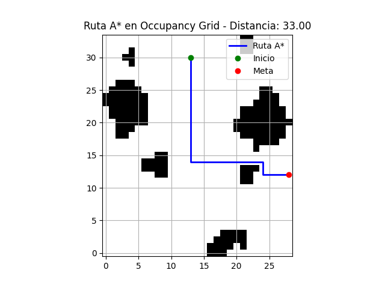
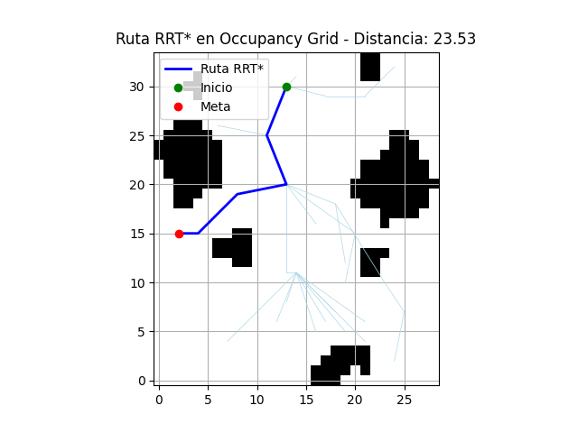

# occupancyGridFromPCD
Occupancy grid from point clouds with Python using Multiway Registration ICP methods from Open3D

See the file Nubes.py to generate the unified PCD from PCD dataset.
Use OccFromPCD.py to generate the OCC GRID and then execute the A* and RRT* path planning 
Examples of output 
A* algorithm
 
RRT* algorithm
 
